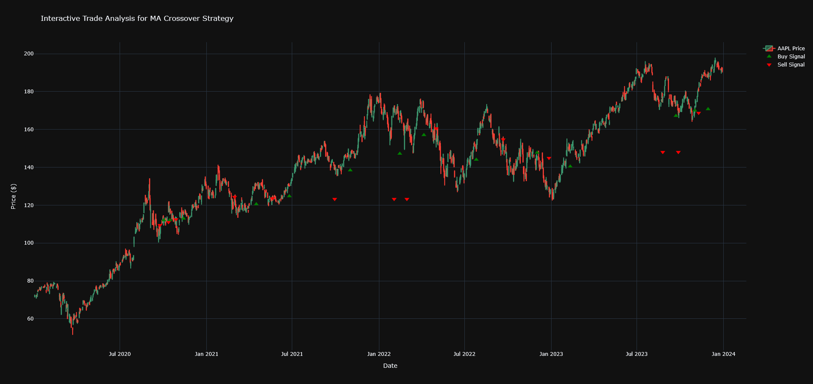

# High-Frequency Trading Engine  

A high-performance trading engine built in C++ for backtesting quantitative trading strategies, including a Python interface for strategy development and analysis.

## Overview

This project is a simplified backtesting platform designed to simulate the core mechanics of a financial exchange. The main components, including the matching engine and order book, are written in C++ for performance. These are exposed to Python via `pybind11`.

The system is designed to be modular and extensible and is still currently a WIP.

## Features

- Market Simulation: The backtester creates a simulated order book for each bar of data, allowing strategies to interact with a realistic bid/ask spread
- Two-layer Design: C++ is used for low-latency order processing, and Python is used for high-level strategy development and data analysis
- Event-based Architecture: Decoupled components communicate through an event dispatcher, allow for modular and extensible development
- Unit Testing: Includes tests for the C++ (`Google Test`) and Python components (`pytest`)

## Getting Started

### Prerequisites
- A C++ compiler that supports C++20
- CMake (version 3.12+)
- Python (version 3.10+)
- Conda or another virtual environment manager is recommended

### Installation
```bash
git clone https://github.com/RDG0818/TradingEngine.git
cd TradingEngine
git submodule update --init --recursive
```

**Set up the Python environment:**
```bash
conda create -n trade python=3.10
conda activate trade
pip install -r requirements.txt 
```

**Build the C++ core:**
```bash
cmake -B build
cmake --build build
stubgen -m trading_core -o .
```

**(Optional) Running Unit Tests:**
```bash
./build/my_tests
pytest
```
## Usage

To run a backtest, execute the main Python script from the root directory:

```bash
python main.py
```
The script will:

1. Download historical data if not present
2. Initialize the C++ matching engine
3. Run the strategy defined in `strategy.py` against the historical data
4. Print the final portfolio performance to the console



## Future Work

- Support for multiple symbols in a single backtest
- Implementation of more complex order types (e.g. Stop-Loss, Iceberg)
- Integration with a visualization library for plotting equity curves and performance metrics
- Support for options and other derivatives
- Support for live paper trading on crypto
- Optimizations for faster high frequency trading
- examples of portfolio optimization and advanced trading strategies

## License
This project is licensed under the MIT License - see the `License.md` file for details.