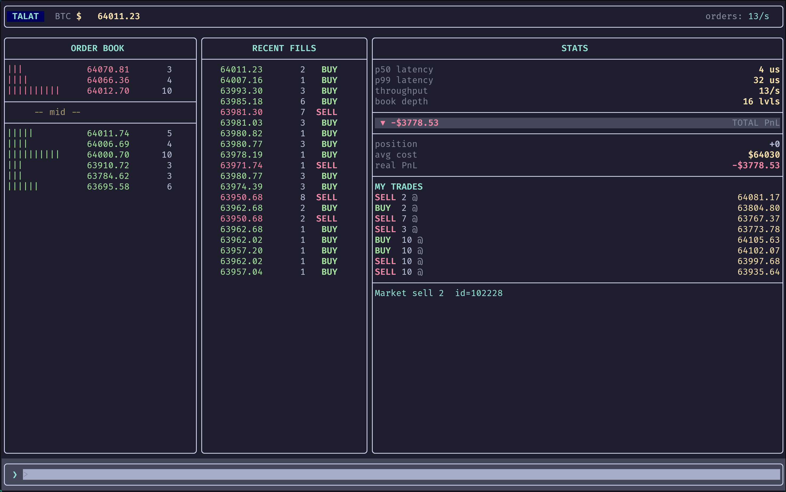

# Talat

A high-performance simulated trading exchange in pure C++20 with a fullscreen terminal UI. *Talat* (ตลาด) means *market* in Thai.



## Requirements

- C++20 compiler (GCC 12+ or Clang 14+)
- CMake 3.14+
- Boost 1.74+

## Build & Run

```bash
git clone --recurse-submodules https://github.com/RDG0818/TradingEngine.git
cd TradingEngine
make build    
make run      
make run -- --seed 50000   
```

```bash
make test     # C++ test suite
make bench    # throughput, latency, contention benchmarks
```

## Commands

Type commands in the bottom bar:

```
buy <qty> @ <price>                  limit buy (GTC)
sell <qty> @ <price>                 limit sell (GTC)
buy <qty> @ <price> fok              limit buy, fill-or-kill
sell <qty> @ <price> fok             limit sell, fill-or-kill
buy <qty>                            market buy (IOC)
sell <qty>                           market sell (IOC)
buy <qty> stop <price>               stop-market buy
buy <qty> stop <price> @ <limit>     stop-limit buy
sell <qty> stop <price> [@ <limit>]  stop-market / stop-limit sell
cancel <order_id>                    cancel a resting order
q / quit                             exit
```

Slash commands to control the simulation:

```
/vol <0.0–1.0>               GBM volatility σ       (default: 0.0003)
/spread <dollars>            market maker half-spread (default: $2.00)
/speed <1–10>                tick speed, 1=2s 10=200ms (default: 1)
/pause / /resume             halt or restart all automated traders
/traders <mm|informed|noise> <n>   set trader count per type
/help                        show command reference
```

## Info

**Order types:** Limit (GTC/IOC/FOK), Market (IOC), Stop-Limit, Stop-Market

**Automated traders** run on a configurable tick thread and drive realistic price action:

| Trader | Behavior |
|---|---|
| `MarketMaker` | Quotes bid+ask ± GBM fair value. Widens spread up to 3× under adverse selection (Glosten-Milgrom). |
| `InformedTrader` | Noisy signal = latent × (1 + N(0,σ)). Submits IOC when signal diverges > 0.2% from last price. |
| `NoiseTrader` | Poisson arrivals (λ=0.7). 60% limit / 40% market split. Log-normal sizes. Random side. |

**Prices** are `uint64_t` fixed-point: `10000 = $1.00` (e.g. $64,200 → `642000000`).

## Performance

Benchmarked on an Intel i7-1255U (12-thread), Release build:

| Metric | Result |
|---|---|
| Submit throughput | 17M orders/sec (lock-free queue) |
| Match latency p50 | 108 µs |
| Match latency p99 | 144 µs |
| Match latency p99.9 | 215 µs |
| Write throughput (4 threads) | 6.7M orders/sec |
| Book snapshot reads (8 threads) | 940K snapshots/sec |

More info: see [docs/DESIGN.md](docs/DESIGN.md).

## License

MIT — see `LICENSE` for details.
